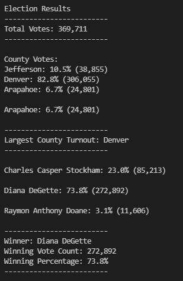

# Election Audit with Python

## Election Audit Overview
Using data from the *election_results.csv* file, Python was used to determine the voter turnout for each county, the percentage of votes from each county out of the total count, and the county with the highest turnout. The output will also include each candidate's names, percentage of the total vote, and total vote count. As well as, the winning candidate's name, percentage of the total vote, and total vote count. 

## Election Audit Results

- A total of 369,711 votes were casted in this congressional election. 
- Number of votes and percentage of total votes per county:
	- Jefferson County had 38,855 votes, which equates to 10.5% of the total votes.
	- Denver County had 306,055 votes, which equates to 82.8% of the total votes.
	- Arapahoe County had 24,801 votes, which equates to 6.7% of the total votes.
- Denver County had the largest number of votes.
- Number of votes and precentage of total votes per candidate:
	- Charles Casper Stockham had 85,213 votes, which equates to 23.0% of the total votes. 
	- Diana DeGette had 272,892 votes, which equates to 73.8% of the total votes.
	- Raymon Anthony Doane had 11,606 votes, which equates to 3.1% of the total votes.
- Diana DeGette won the congressional election. The vote count and percentage of the total vote were 272,892 and 73.8%, respectively. 

## Election-Audit Summary
The script provided in the *PyPoll_challenge.py* file shows that it can successfully handle a dataset containing a total of 369,711 votes for three counties and three candidates. The script can easily handle an election of this size or bigger - whether there is an increase in total votes, number of counties, or number of candidates. This is due to the fact that different variables were used to set the different counties and candidates, number of votes for each counties and candidates, and more. Therefore, the script can be used for any election with any number of votes, candidates, and counties. 

Unfortunately, the script is not all encompassing. Fortunately, the script can easily be modified to be used for other elections based on the types of data analysis that is needed. The script can be modified to include the percentage of votes each candidate received in each county. This information can help the candidate regarding which counties they need to work on for any future elections. The script can also be modified to include how close the race was for each candidate and county, and candidate within each county. The ouput does a good job in providing important information. However, it can be more detailed by reporting counties or candidates in second place and how close (in terms of votes) they were from the winning county and candidate. Similar to the first modification, information such as this can be beneficial to the candidates on how and where to improve. 

Additionally, the format of the .csv file does not have to be set in stone i.e. the first, second, and third columns do not always have to represent the ballot ID, county, and candidate. The script can be modified to if these columns were not in the same order. If more data was provided with additional columns, the script can also be modified to include data analysis on the additional column with data. 